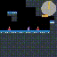
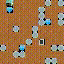

# TEAL - PyTorch Embodied Agents Lib

Welcome to the project page of **`teal`**. This repository aims to provide a minimal, hackable code base for reinforcement learning and embodied intelligence research.


## Implemented algorithms

- [x] **Proximal Policy Optimization (ppo)** [^1]
- [ ] Soft-Actor Critic (sac) [^3]
- [ ] DreamerV3 [^4]

[^1]: From "[Proximal Policy Optimization Algorithms](https://arxiv.org/abs/1707.06347)" by John Schulman, Filip Wolski, Prafulla Dhariwal, Alec Radford, Oleg Klimov
[^2]: From "[Phasic Policy Gradient](https://arxiv.org/abs/2009.04416)" by Karl Cobbe, Jacob Hilton, Oleg Klimov, John Schulman
[^3]: From "[Soft Actor-Critic: Off-Policy Maximum Entropy Deep Reinforcement Learning with a Stochastic Actor](https://arxiv.org/abs/1801.01290)" by Tuomas Haarnoja, Aurick Zhou, Pieter Abbeel, Sergey Levine
[^4]: From "[Mastering Diverse Domains through World Models](https://arxiv.org/abs/2301.04104)" by Danijar Hafner, Jurgis Pasukonis, Jimmy Ba, Timothy Lillicrap

## Getting started

To install teal, run:

```bash
pip install teal
```


### Train a ppo agent in Procgen environment

```bash
python scripts/train.py +experiment=ppo_procgen env=miner
```

After one or two hours, you should get agents like this:

|            Jumper            |              Starpilot             |            Miner           |
| :--------------------------: | :--------------------------------: | :------------------------: |
|  |  |  |

